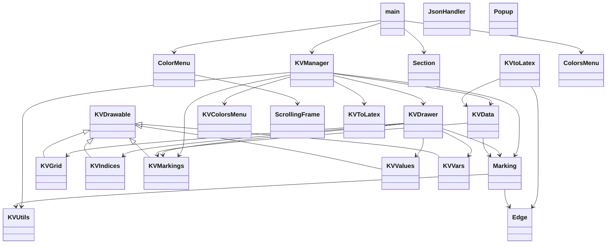

```mermaid
classDiagram
  class main {}
  class KVManager {}
  class KVDrawer {}
  class KVtoLatex {}
  class KVUtils {}
  class KVData {}
  class Edge {}
  class Marking {}
  class JsonHandler {}

  class KVDrawable {}
  class KVGrid {}
  class KVIndices {}
  class KVMarkings {}
  class KVValues {}
  class KVVars {}

  class KVColorsMenu {}
  class Popup {}
  class ScrollingFrame {}
  class Section {}
  class ColorMenu {}

  main --> KVManager
  main --> ColorsMenu
  main --> ColorMenu
  main --> Section
  ColorMenu --> ScrollingFrame
  KVManager --> KVUtils
  KVManager --> KVDrawer
  KVManager --> KVColorsMenu
  KVManager --> KVToLatex
  KVManager --> KVData
  KVManager --> Marking
  KVManager --> KVMarkings
  KVDrawer --> Marking
  KVDrawer --> KVIndices
  KVDrawer --> KVGrid
  KVDrawer --> KVMarkings
  KVDrawer --> KVValues
  KVDrawer --> KVVars
  KVtoLatex --> KVData
  KVtoLatex --> Edge
  KVData --> Marking
  KVData --> KVMarkings
  Marking --> Edge
  Marking --> KVUtils
  KVDrawable <|-- KVGrid
  KVDrawable <|-- KVIndices
  KVDrawable <|-- KVMarkings
  KVDrawable <|-- KVValues
  KVDrawable <|-- KVVars
```
